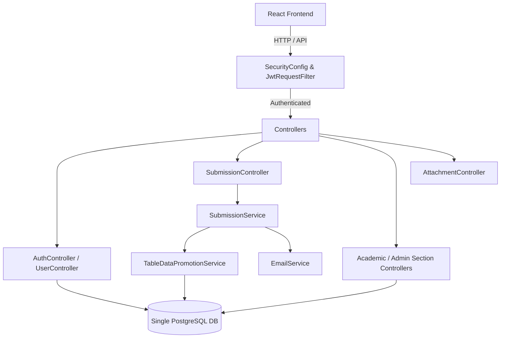
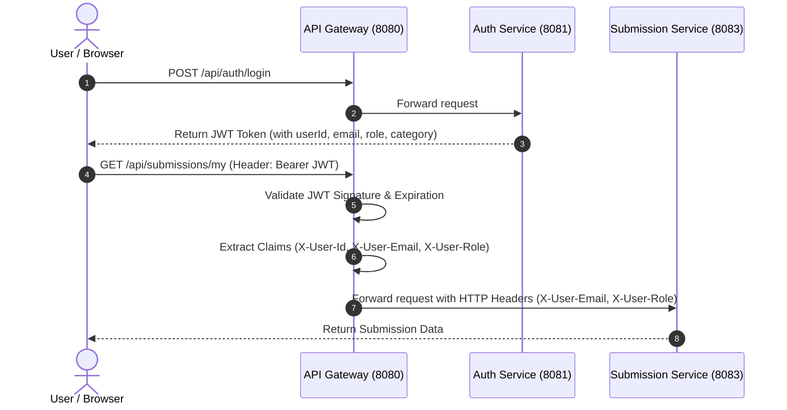
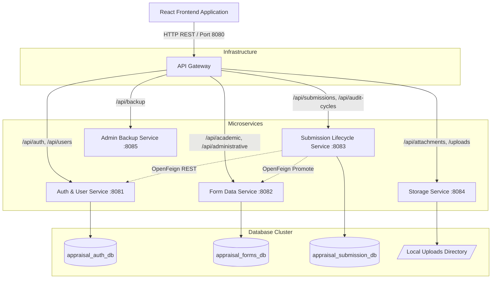

# Microservices Migration Master Guide — Director / School Appraisal Backend

> **IMPORTANT NOTICE FOR DEVELOPERS & MAINTAINERS**  
> **Do not start implementing the migration until this guide has been reviewed and approved.**

---

## Executive Summary

This document serves as the authoritative, end-to-end architectural blueprint and step-by-step implementation guide for refactoring the **Java Spring Boot Monolithic Backend** (`director-appraisal`) into a production-grade **Microservices Architecture**. 

The current monolith combines Authentication, User Management, Appraisal Submission Lifecycles, Academic Section Audit Forms (39 entities), Administrative Section Audit Forms (25 entities), File Storage, Database Table Data Promotion, and System Backups into a single deployable application.

This guide outlines an incremental, non-disruptive **Strangler Fig Migration Strategy**, guaranteeing zero downtime and preserving all existing security models, REST API contracts, and database integrity.

---

## Table of Contents

1. [Step 1 — Analysis of Existing Backend](#step-1--analysis-of-existing-backend)
2. [Step 2 — Business Modules & Domain Decomposition](#step-2--business-modules--domain-decomposition)
3. [Step 3 — Analysis of Current Monolithic Architecture](#step-3--analysis-of-current-monolithic-architecture)
4. [Step 4 — Target Microservices Architecture Design](#step-4--target-microservices-architecture-design)
5. [Step 5 — Database Architecture & Data Ownership](#step-5--database-architecture--data-ownership)
6. [Step 6 — Flyway Migration Strategy](#step-6--flyway-migration-strategy)
7. [Step 7 — Authentication & Security Architecture](#step-7--authentication--security-architecture)
8. [Step 8 — Service-to-Service Communication](#step-8--service-to-service-communication)
9. [Step 9 — API Gateway Design & Route Registry](#step-9--api-gateway-design--route-registry)
10. [Step 10 — Repository & Folder Structure](#step-10--repository--folder-structure)
11. [Step 11 — Incremental Migration Strategy (Strangler Fig Pattern)](#step-11--incremental-migration-strategy-strangler-fig-pattern)
12. [Step 12 — Exact Implementation Sequence](#step-12--exact-implementation-sequence)
13. [Step 13 — Configuration & Secret Management](#step-13--configuration--secret-management)
14. [Step 14 — Comprehensive Testing Strategy](#step-14--comprehensive-testing-strategy)
15. [Step 15 — Local Development & Environment Setup](#step-15--local-development--environment-setup)
16. [Step 16 — Deployment & Infrastructure Architecture](#step-16--deployment--infrastructure-architecture)
17. [Step 17 — Mermaid Architecture & Request Flow Diagrams](#step-17--mermaid-architecture--request-flow-diagrams)
18. [Step 18 — Comprehensive Risk Analysis & Mitigation Matrix](#step-18--comprehensive-risk-analysis--mitigation-matrix)
19. [Step 19 — Before vs After Architecture Comparison](#step-19--before-vs-after-architecture-comparison)
20. [Step 20 — Final Architecture Recommendation Summary](#step-20--final-architecture-recommendation-summary)

---

## Step 1 — Analysis of Existing Backend

### 1.1 Project Structure Overview
* **Root Location**: `DirectorAppraisal/director-appraisal`
* **Build System**: Apache Maven (`pom.xml`)
* **Java SDK**: OpenJDK / Java 17
* **Base Package**: `com.director_appraisal.director_appraisal`

```text
com.director_appraisal.director_appraisal/
├── config/                  # SecurityConfig, JwtRequestFilter, WebMvcConfig, LoggingAspect, UrlPostProcessorConfig
├── controller/              # AuthController, UserController, SubmissionController, AttachmentController, AuditCycleController, BackupController
│   ├── academic/            # 39 Academic Audit Table Controllers (Alumni, Research, NepStatus, OBE, etc.)
│   └── administrative/      # 25 Administrative Audit Table Controllers (Courses, Infrastructure, Finance, etc.)
├── model/                   # Core Entities: User, Submission, SubmissionAuditorAssignment, AcademicYear, MfaLoginSession, Snapshot
│   ├── academic/            # 39 JPA Entities matching Academic Audit tables
│   └── administrative/      # 25 JPA Entities matching Administrative Audit tables
├── repository/              # Spring Data JPA Repositories for core entities
│   ├── academic/            # 39 Repositories for Academic entities
│   └── administrative/      # 25 Repositories for Administrative entities
├── service/                 # UserService, SubmissionService, AttachmentService, TableDataPromotionService, AcademicYearService, etc.
│   ├── academic/            # 39 Services handling Academic section row operations
│   └── administrative/      # 25 Services handling Administrative section row operations
└── util/                    # SchoolUtils, UrlPostProcessor
```

### 1.2 Technology Stack & Component Versions (Verified from `pom.xml`)

| Component | Framework / Library | Version | Description / Purpose |
|---|---|---|---|
| **Language** | Java | `17` | OpenJDK 17 LTS |
| **Framework** | Spring Boot | `3.3.4` | Core MVC, Data JPA, Security, Mail, AOP |
| **Security** | Spring Security | `6.3` / `Boot 3.3.4` | Stateless SecurityFilterChain, BCrypt Password Encoding |
| **JWT** | JJWT | `0.12.5` | `jjwt-api`, `jjwt-impl`, `jjwt-jackson` (HMAC SHA-256 tokens) |
| **Database** | PostgreSQL | Driver `runtime` | Relational storage for appraisal records & system data |
| **Migrations** | Flyway | Core & PostgreSQL plugin | Versioned SQL scripts (`V1__init_schema.sql` to `V20__add_sdg_address_to_nep_status.sql`) |
| **Boilerplate** | Lombok | `1.18.34` | `@Data`, `@Getter`, `@Setter`, `@Builder`, `@RequiredArgsConstructor` |
| **File Storage** | Local FS / Custom | Custom Bean | `LocalFileStorageService` implementing `StorageService` interface |
| **Rate Limiting**| In-memory / Redis | `spring-boot-starter-data-redis` | Login/MFA attempt rate limiters |
| **Mail** | JavaMailSender | `spring-boot-starter-mail` | OTP verification emails and status notification alerts |

---

## Step 2 — Business Modules & Domain Decomposition

Following Domain-Driven Design (DDD) principles, the monolithic application is decomposed into **5 core logical domains**:

```
                       ┌──────────────────────────────────────────┐
                       │          API GATEWAY (Port 8080)         │
                       └────────────────────┬─────────────────────┘
                                            │
        ┌───────────────────┬───────────────┼───────────────┬───────────────────┐
        ▼                   ▼               ▼               ▼                   ▼
┌───────────────┐   ┌───────────────┐ ┌───────────┐ ┌───────────────┐   ┌───────────────┐
│ Auth & User   │   ┌ Audit Form    │ │Submission │ │ Attachment &  │   │ System Backup │
│ Management    │   │ Data Service  │ │ Lifecycle │ │ Media Service │   │ & Admin Svc   │
│ Service       │   │ Service       │ │ Service   │ │               │   │               │
│ (Port 8081)   │   │ (Port 8082)   │ │(Port 8083)│ │ (Port 8084)   │   │ (Port 8085)   │
└───────────────┘   └───────────────┘ └───────────┘ └───────────────┘   └───────────────┘
```

### Module Breakdown Details

#### 1. Auth & User Management Service (`identity-service`)
* **Responsibility**: User registration, authentication, MFA OTP verification, 24-hour Access JWT generation, 7-day Refresh Token management, password resets, role-based user management, and user avatar storage metadata.
* **Controllers**: `AuthController.java`, `UserController.java`
* **Services**: `UserService.java`, `JwtService.java`, `RefreshTokenService.java`, `MfaService.java`, `RateLimiterService.java`, `EmailService.java`
* **Entities**: `User`, `UserAdministrativePost`, `RefreshToken`, `MfaLoginSession`, `PasswordResetToken`
* **Owned Tables**: `users`, `user_administrative_posts`, `refresh_tokens`, `mfa_login_sessions`, `password_reset_tokens`
* **Exposed APIs**: `/api/auth/**` (including `/login`, `/verify-otp`, `/refresh`, `/logout`), `/api/users/**`

#### 2. Appraisal Submission & Workflow Service (`submission-service`)
* **Responsibility**: Appraisal form lifecycle management, submission status transitions (`DRAFT`, `SUBMITTED`, `AUDITOR_COMPLETED`, `APPROVED`, `CORRECTION_REQUESTED`), auditor assignments, academic year scoping, versioning (`submission_report_versions`), successor cycle generation (`POST /api/submissions/{id}/next-cycle`), and sign-off validations.
* **Controllers**: `SubmissionController.java`, `AuditCycleController.java`
* **Services**: `SubmissionService.java`, `AcademicYearService.java`, `TableDataPromotionService.java`
* **Entities**: `Submission`, `SubmissionAuditorAssignment`, `SubmissionReportVersion`, `Snapshot`, `AcademicYear`
* **Owned Tables**: `submissions`, `submission_auditor_assignments`, `submission_report_versions`, `snapshots`, `academic_years`
* **Exposed APIs**: `/api/submissions/**`, `/api/audit-cycles/**`

#### 3. Audit Form Section Data Service (`form-data-service`)
* **Responsibility**: Manages the granular relational tables backing Part A, Part B, and Administrative Office form sections (39 Academic tables + 25 Administrative tables). Performs table data promotion from JSON blobs to SQL rows upon approval.
* **Controllers**: `controller/academic/*` (39 files), `controller/administrative/*` (25 files)
* **Services**: `service/academic/*` (39 files), `service/administrative/*` (25 files)
* **Entities**: `model/academic/*` (39 files), `model/administrative/*` (25 files)
* **Owned Tables**: 64 distinct relational tables (e.g. `nep_status`, `research_publications`, `courses_offered`, `it_infrastructure`, etc.)
* **Exposed APIs**: `/api/academic/**`, `/api/administrative/**`

#### 4. Attachment & Storage Service (`storage-service`)
* **Responsibility**: File upload validation, physical storage on local disk / cloud, file stream downloads, and path normalization.
* **Controllers**: `AttachmentController.java`
* **Services**: `AttachmentService.java`, `StorageService.java`, `LocalFileStorageService.java`
* **Entities**: None (Operates on file system metadata)
* **Owned Storage**: Local `/app/uploads` file system directory
* **Exposed APIs**: `/api/attachments/**`, `/uploads/**`

#### 5. System Administration & Backup Service (`admin-service`)
* **Responsibility**: Database backup dump creation, backup restoration, system health diagnostics, and administrative maintenance.
* **Controllers**: `BackupController.java`
* **Services**: `BackupService.java`
* **Entities**: None (Interacts with PostgreSQL `pg_dump` and `psql` binaries)
* **Exposed APIs**: `/api/backup/**`

---

## Step 3 — Analysis of Current Monolithic Architecture

### 3.1 Monolithic Interaction Flow
Currently, all HTTP requests hit a single Spring Boot process running on port `8080`.



### 3.2 Key Architectural Challenges in the Monolith
1. **Tight Coupling & Giant Classes**: `SubmissionService.java` spans over 3,900 lines of code handling dynamic auditor evaluation, versioning, mail alerts, JSON manipulation, and JPA transactions simultaneously.
2. **Shared Database & Lack of Boundaries**: 72 database tables exist within a single public schema. Direct SQL JOINs and entity relationships across User, Submission, and Form Data make independent schema evolution difficult.
3. **Deployability & Single Point of Failure**: A failure in file upload or backup streaming can stall thread pools and take down login and submission services.
4. **Build & Test Overhead**: Every small change requires recompiling 303 Java source files and running full Flyway migration checks on startup.

---

## Step 4 — Target Microservices Architecture Design

### 4.1 Service Topology & Port Allocation

| Microservice Name | Primary Responsibility | Port | Database / Schema Owned |
|---|---|---|---|
| **`api-gateway`** | Routing, Central CORS, Rate Limiting, JWT Verification | `8080` | None |
| **`auth-user-service`** | Authentication, User Accounts, MFA, Roles, Profiles | `8081` | `appraisal_auth_db` |
| **`form-data-service`** | 64 Academic & Administrative Form Section Tables | `8082` | `appraisal_forms_db` |
| **`submission-service`**| Submission Lifecycle, Versions, Approvals, Assignments | `8083` | `appraisal_submission_db` |
| **`storage-service`** | File Uploads, Attachment Downloads, Local Storage | `8084` | File System Storage (`/app/uploads`) |
| **`admin-service`** | PostgreSQL Database Backups, Dump/Restore Jobs | `8085` | Indirect access to `pg_dump` |

### 4.2 Detailed Specifications per Microservice

#### Service 1: `api-gateway`
* **Framework**: Spring Cloud Gateway (Spring Boot 3.3.4)
* **Port**: `8080`
* **Responsibilities**:
  * Single entry point for React frontend
  * Validates incoming JWT tokens before forwarding requests downstream
  * Handles Global CORS configuration
  * Routes `/api/auth/**` and `/api/users/**` $\rightarrow$ `8081`
  * Routes `/api/academic/**` and `/api/administrative/**` $\rightarrow$ `8082`
  * Routes `/api/submissions/**` and `/api/audit-cycles/**` $\rightarrow$ `8083`
  * Routes `/api/attachments/**` and `/uploads/**` $\rightarrow$ `8084`
  * Routes `/api/backup/**` $\rightarrow$ `8085`

#### Service 2: `auth-user-service`
* **Port**: `8081`
* **Database**: `appraisal_auth_db`
* **Packages**: `com.director_appraisal.auth`
* **Core Components**: `AuthController`, `UserController`, `UserService`, `JwtService`, `MfaService`, `EmailService`
* **Tables**: `users`, `user_administrative_posts`, `mfa_login_sessions`, `password_reset_tokens`

#### Service 3: `form-data-service`
* **Port**: `8082`
* **Database**: `appraisal_forms_db`
* **Packages**: `com.director_appraisal.forms`
* **Core Components**: 64 Section Controllers, 64 Section Services, 64 JPA Repositories
* **Tables**: `alumni_interactions`, `nep_status`, `research_publications`, `courses_offered`, `it_infrastructure`, etc. (64 total)

#### Service 4: `submission-service`
* **Port**: `8083`
* **Database**: `appraisal_submission_db`
* **Packages**: `com.director_appraisal.submission`
* **Core Components**: `SubmissionController`, `AuditCycleController`, `SubmissionService`, `AcademicYearService`, `TableDataPromotionService`
* **Tables**: `submissions`, `submission_auditor_assignments`, `submission_report_versions`, `snapshots`, `academic_years`

#### Service 5: `storage-service`
* **Port**: `8084`
* **Database**: Disk storage (`/app/uploads`)
* **Packages**: `com.director_appraisal.storage`
* **Core Components**: `AttachmentController`, `AttachmentService`, `LocalFileStorageService`

#### Service 6: `admin-service`
* **Port**: `8085`
* **Packages**: `com.director_appraisal.admin`
* **Core Components**: `BackupController`, `BackupService`

---

## Step 5 — Database Architecture & Data Ownership

### 5.1 Database Partitioning Strategy
To ensure pragmatic operation while strictly adhering to the **Database-per-Service** pattern, we use **Separate PostgreSQL Databases on a Shared PostgreSQL Instance**:

```text
PostgreSQL Instance (Port 5432)
├── Database: appraisal_auth_db        (Owned by auth-user-service)
├── Database: appraisal_forms_db       (Owned by form-data-service)
└── Database: appraisal_submission_db (Owned by submission-service)
```

* **Rationale**: Running separate logical databases (`CREATE DATABASE appraisal_auth_db;`) on a single PostgreSQL server prevents cross-database foreign key constraints while avoiding the resource overhead of running 3 separate database server containers.

### 5.2 Decoupling Cross-Service Relationships
In the monolith, `Submission` held direct foreign keys or object references to `User` (e.g. `auditor_reviewed_by_email`).

**Microservice Rule**:
* Entities in `submission-service` must store **User IDs (`userId`) or Emails (`userEmail`) as plain scalar values** rather than JPA `@ManyToOne` bindings to `User`.
* When submission details need user metadata (e.g. Director Name or Auditor Designation), `submission-service` fetches user details via a REST HTTP call (`OpenFeign`) to `auth-user-service` or receives user claims directly from the JWT context header.

---

## Step 6 — Flyway Migration Strategy

Each microservice manages its own database schema independently using Flyway.

### 6.1 Distribution of Flyway Scripts

```text
auth-user-service/src/main/resources/db/migration/
├── V1__init_auth_schema.sql         (users, user_administrative_posts)
├── V2__create_mfa_sessions.sql       (mfa_login_sessions, password_reset_tokens)
├── V3__add_avatar_url.sql           (alter users add avatar_url)
└── V4__create_refresh_tokens_table.sql (refresh_tokens)

submission-service/src/main/resources/db/migration/
├── V1__init_submission_schema.sql   (submissions, submission_report_versions)
├── V2__add_auditor_assignments.sql  (submission_auditor_assignments, snapshots)
└── V3__add_academic_years.sql       (academic_years)

form-data-service/src/main/resources/db/migration/
├── V1__init_academic_tables.sql     (39 academic tables)
├── V2__init_administrative_tables.sql (25 administrative tables)
└── V3__add_sdg_address.sql          (alter nep_status add sdg_address)
```

### 6.2 Migration Execution Protocol
1. Each service has its own `spring.flyway.locations=classpath:db/migration`.
2. Microservices execute migrations **only against their dedicated database**.
3. Existing Flyway version tables (`flyway_schema_history`) remain isolated per database.

---

## Step 7 — Authentication & Security Architecture

### 7.1 Security & Token Flow



### 7.2 Security Header Propagation
Downstream services (e.g. `submission-service`, `form-data-service`) do not need to re-query the database to verify credentials. The API Gateway strips sensitive credentials and injects validated user headers:
* `X-User-Id`: `42`
* `X-User-Email`: `director.socsea@dypiu.ac.in`
* `X-User-Role`: `director`
* `X-User-School`: `SOCSEA`

Downstream services configure a lightweight `PreFilter` that sets Spring Security's `SecurityContextHolder` based on these trusted `X-User-*` headers.

---

## Step 8 — Service-to-Service Communication

### 8.1 Communication Matrix

| Sender Service | Receiver Service | Protocol | Purpose / Action |
|---|---|---|---|
| `submission-service` | `auth-user-service` | HTTP REST (OpenFeign) | Fetch auditor emails & post assignments for dynamic audit completion checks |
| `submission-service` | `form-data-service` | HTTP REST (OpenFeign) | Trigger table data promotion when report is approved (`POST /internal/promote`) |
| `submission-service` | `auth-user-service` | Async Event / Mail REST | Trigger email notification when auditor sign-off occurs |

### 8.2 Resilience Controls (Resilience4j)
All inter-service HTTP calls use **OpenFeign** wrapped with **Resilience4j**:
* **Connect Timeout**: `2000ms`
* **Read Timeout**: `5000ms`
* **Circuit Breaker**: Slidewindow size 10, 50% failure rate threshold.
* **Fallback**: When `auth-user-service` is unreachable during submission query, `submission-service` uses cached user metadata stored in submission snapshots.

---

## Step 9 — API Gateway Design & Route Registry

### 9.1 Spring Cloud Gateway Route Rules (`application.yaml`)

```yaml
server:
  port: 8080

spring:
  cloud:
    gateway:
      corsConfigurations:
        '[/**]':
          allowedOrigins: "*"
          allowedMethods: "*"
          allowedHeaders: "*"
      routes:
        - id: auth-service-route
          uri: http://localhost:8081
          predicates:
            - Path=/api/auth/**, /api/users/**

        - id: form-data-service-route
          uri: http://localhost:8082
          predicates:
            - Path=/api/academic/**, /api/administrative/**

        - id: submission-service-route
          uri: http://localhost:8083
          predicates:
            - Path=/api/submissions/**, /api/audit-cycles/**

        - id: storage-service-route
          uri: http://localhost:8084
          predicates:
            - Path=/api/attachments/**, /uploads/**

        - id: admin-service-route
          uri: http://localhost:8085
          predicates:
            - Path=/api/backup/**
```

---

## Step 10 — Repository & Folder Structure

The target repository will be structured as a **Multi-Module Maven Workspace**:

```text
DirectorAppraisal/
├── pom.xml                         # Parent POM (Dependency Management)
├── Microservices_guide.md          # This Guide
├── api-gateway/                    # Port 8080
│   ├── pom.xml
│   └── src/main/
│       ├── java/com/director_appraisal/gateway/
│       └── resources/application.yaml
├── auth-user-service/              # Port 8081
│   ├── pom.xml
│   └── src/main/
│       ├── java/com/director_appraisal/auth/
│       │   ├── controller/
│       │   ├── model/
│       │   ├── repository/
│       │   └── service/
│       └── resources/
│           ├── application.yaml
│           └── db/migration/
├── form-data-service/              # Port 8082
│   ├── pom.xml
│   └── src/main/
│       ├── java/com/director_appraisal/forms/
│       │   ├── controller/ (academic & administrative)
│       │   ├── model/      (academic & administrative)
│       │   ├── repository/ (academic & administrative)
│       │   └── service/    (academic & administrative)
│       └── resources/
│           ├── application.yaml
│           └── db/migration/
├── submission-service/             # Port 8083
│   ├── pom.xml
│   └── src/main/
│       ├── java/com/director_appraisal/submission/
│       │   ├── client/     (OpenFeign Clients to Auth & Forms)
│       │   ├── controller/
│       │   ├── model/
│       │   ├── repository/
│       │   └── service/
│       └── resources/
│           ├── application.yaml
│           └── db/migration/
├── storage-service/                # Port 8084
│   ├── pom.xml
│   └── src/main/
│       ├── java/com/director_appraisal/storage/
│       └── resources/application.yaml
└── admin-service/                  # Port 8085
    ├── pom.xml
    └── src/main/
        ├── java/com/director_appraisal/admin/
        └── resources/application.yaml
```

---

## Step 11 — Incremental Migration Strategy (Strangler Fig Pattern)

Instead of a high-risk "big bang" rewrite, we apply the **Strangler Fig Pattern** across 4 progressive phases:

```text
Phase 1: Deploy API Gateway in front of Monolith (Zero API Contract Change)
       ↓
Phase 2: Extract Auth & User Service (Port 8081) — Redirect /api/auth & /api/users to 8081
       ↓
Phase 3: Extract Storage & Admin Services (Ports 8084, 8085)
       ↓
Phase 4: Extract Form Data Service & Submission Service (Monolith fully decommissioned)
```

---

## Step 12 — Exact Implementation Sequence

### Phase 1 — Parent POM & API Gateway Proxying
1. Convert `pom.xml` to `<packaging>pom</packaging>` parent module.
2. Initialize `api-gateway` module with Spring Cloud Gateway starter.
3. Configure routes in `api-gateway` pointing all `/api/**` endpoints to existing Monolith running on port `8080`.
4. Point React frontend `VITE_API_BASE_URL` to Gateway (`http://localhost:8080`).

### Phase 2 — Extract Auth & User Service (`auth-user-service`)
1. Create `auth-user-service` Spring Boot module on port `8081`.
2. Copy `User`, `UserAdministrativePost`, `MfaLoginSession`, `PasswordResetToken` entities and migrations `V1`, `V15`, `V17`, `V19`.
3. Create database `appraisal_auth_db` and verify Flyway startup.
4. Move `AuthController`, `UserController`, `UserService`, `JwtService`, `MfaService`.
5. Update `api-gateway` routes for `/api/auth/**` and `/api/users/**` to target `http://localhost:8081`.

### Phase 3 — Extract Attachment & Storage Service (`storage-service`)
1. Create `storage-service` module on port `8084`.
2. Move `AttachmentController`, `AttachmentService`, `LocalFileStorageService`.
3. Update `api-gateway` routes for `/api/attachments/**` and `/uploads/**` to target `http://localhost:8084`.

### Phase 4 — Extract Form Data Service (`form-data-service`)
1. Create `form-data-service` module on port `8082`.
2. Copy 64 section controllers, models, and repositories.
3. Create database `appraisal_forms_db` and migrate section tables.
4. Expose internal promotion API (`POST /internal/promote`).

### Phase 5 — Extract Submission Service (`submission-service`) & Decommission Monolith
1. Create `submission-service` module on port `8083`.
2. Move `SubmissionController`, `AuditCycleController`, `SubmissionService`, `AcademicYearService`, `TableDataPromotionService`.
3. Configure OpenFeign clients to call `auth-user-service` (for auditor checks) and `form-data-service` (for promotion).
4. Create database `appraisal_submission_db`.
5. Update `api-gateway` routes for `/api/submissions/**` to target `http://localhost:8083`.
6. Terminate monolithic process.

---

## Step 13 — Configuration & Secret Management

### Environment Variables Matrix

```bash
# Gateway
PORT=8080
JWT_SECRET=SecretKeyForJWTAppraisalMustBeAtLeast256BitsLongForHMACSHA256

# Auth Service (8081)
AUTH_DB_URL=jdbc:postgresql://localhost:5432/appraisal_auth_db
DB_USERNAME=postgres
DB_PASSWORD=postgres
SMTP_HOST=smtp.gmail.com
SMTP_USER=appraisal@dypiu.ac.in
SMTP_PASSWORD=app-password

# Form Data Service (8082)
FORMS_DB_URL=jdbc:postgresql://localhost:5432/appraisal_forms_db

# Submission Service (8083)
SUBMISSION_DB_URL=jdbc:postgresql://localhost:5432/appraisal_submission_db
AUTH_SERVICE_URL=http://localhost:8081
FORMS_SERVICE_URL=http://localhost:8082

# Storage Service (8084)
UPLOAD_LOCAL_PATH=/opt/myapp/uploads
```

---

## Step 14 — Comprehensive Testing Strategy

1. **Unit Testing**: JUnit 5 & Mockito testing for `SubmissionService` auditor logic and `UserService` validation.
2. **Integration Testing**: `@SpringBootTest` with Testcontainers PostgreSQL for Flyway migration verification.
3. **Contract Testing**: Spring Cloud Contract to ensure OpenFeign request/response contracts between `submission-service` and `auth-user-service` remain compatible.
4. **End-to-End API Testing**: Postman regression suite executed against `api-gateway` (port `8080`).

---

## Step 15 — Local Development & Environment Setup

To run the complete microservice suite locally:

```bash
# 1. Build all modules from root
mvn clean package -DskipTests

# 2. Start Services in Order
java -jar auth-user-service/target/auth-user-service-0.0.1-SNAPSHOT.jar &
java -jar form-data-service/target/form-data-service-0.0.1-SNAPSHOT.jar &
java -jar submission-service/target/submission-service-0.0.1-SNAPSHOT.jar &
java -jar storage-service/target/storage-service-0.0.1-SNAPSHOT.jar &
java -jar admin-service/target/admin-service-0.0.1-SNAPSHOT.jar &
java -jar api-gateway/target/api-gateway-0.0.1-SNAPSHOT.jar &
```

---

## Step 16 — Deployment & Infrastructure Architecture

### Production Docker Compose Setup (`docker-compose.yml`)

```yaml
version: '3.8'

services:
  postgres:
    image: postgres:16-alpine
    container_name: appraisal-postgres
    environment:
      POSTGRES_PASSWORD: postgres
    ports:
      - "5432:5432"
    volumes:
      - pgdata:/var/lib/postgresql/data

  api-gateway:
    build: ./api-gateway
    ports:
      - "8080:8080"
    environment:
      - AUTH_SERVICE_URL=http://auth-user-service:8081
      - SUBMISSION_SERVICE_URL=http://submission-service:8083
    depends_on:
      - auth-user-service
      - submission-service

  auth-user-service:
    build: ./auth-user-service
    ports:
      - "8081:8081"
    environment:
      - DATABASE_URL=jdbc:postgresql://postgres:5432/appraisal_auth_db
    depends_on:
      - postgres

  submission-service:
    build: ./submission-service
    ports:
      - "8083:8083"
    environment:
      - DATABASE_URL=jdbc:postgresql://postgres:5432/appraisal_submission_db
      - AUTH_SERVICE_URL=http://auth-user-service:8081
    depends_on:
      - postgres
      - auth-user-service

volumes:
  pgdata:
```

---

## Step 17 — Mermaid Architecture & Request Flow Diagrams

### 17.1 Target Microservices Architecture



---

## Step 18 — Comprehensive Risk Analysis & Mitigation Matrix

| Risk Event | Severity | Probability | Impact Description | Mitigation & Prevention Strategy |
|---|---|---|---|---|
| **Data Loss during Table Migration** | High | Low | Table row loss during single DB to 3 DB splitting | Backup database using `pg_dump` before each phase; verify row counts post migration |
| **Orphaned References Across Services** | Medium | Medium | User deletion leaving broken `userId` in `submission-service` | Enforce soft deletion (`deleted=true`) in `auth-user-service`; `submission-service` handles null user lookups gracefully |
| **Inter-Service Latency Overheads** | Low | Medium | HTTP Feign calls adding delay to submission processing | Implement Redis caching for user roles & auditor assignments in `submission-service` |
| **JWT Key Mismatch Across Services** | High | Low | Downstream services rejecting valid Gateway tokens | Centralize `JWT_SECRET` in environment variable; share common JWT validation library |

---

## Step 19 — Before vs After Architecture Comparison

| Architectural Dimension | Current Monolith (`director-appraisal`) | Target Microservices Architecture |
|---|---|---|
| **Deployability** | Single 303-class JAR deployment | Independent service JAR / container deployments |
| **Database Structure** | Single `director_appraisal` DB (72 tables) | 3 Isolated DBs (`appraisal_auth_db`, `appraisal_forms_db`, `appraisal_submission_db`) |
| **Authentication** | Embedded Spring Security filter in monolith | Gateway-level JWT validation & header propagation |
| **Fault Isolation** | High risk (backup crash affects login) | Total isolation (storage failure does not affect auth) |
| **Scalability** | Scale whole monolith instance | Scale `submission-service` independently based on traffic |
| **Code Maintainability** | 3,900+ line service classes | Modular, focused services under 500 lines per domain |

---

## Step 20 — Final Architecture Recommendation Summary

1. **Microservices Breakdown**: 5 business microservices (`auth-user-service`, `form-data-service`, `submission-service`, `storage-service`, `admin-service`) + 1 `api-gateway`.
2. **Database Strategy**: Database-per-service using logical databases on a single PostgreSQL cluster (`appraisal_auth_db`, `appraisal_forms_db`, `appraisal_submission_db`).
3. **Migration Approach**: Strangler Fig Pattern — introduce `api-gateway` first without modifying frontend API contracts.
4. **Security**: Centralized Gateway JWT validation with trusted header propagation to downstream services.

> **CRITICAL REMINDER FOR DEVELOPERS**  
> **Do not start implementing the migration until this guide has been reviewed and approved.**
